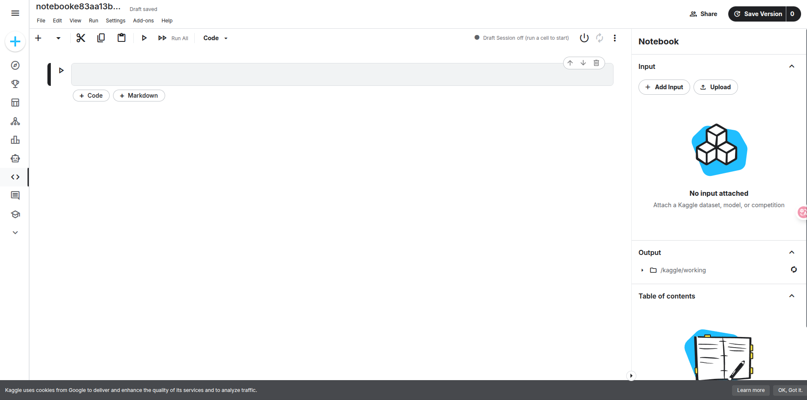
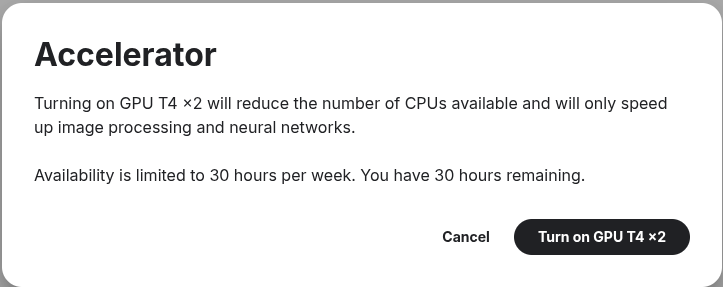
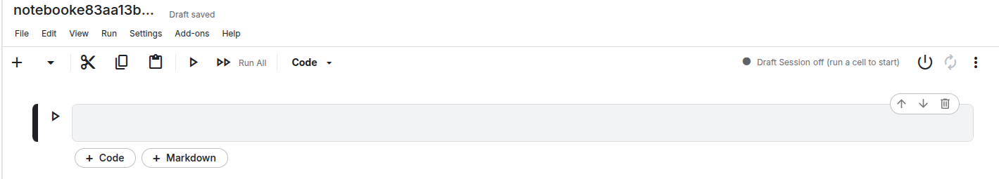
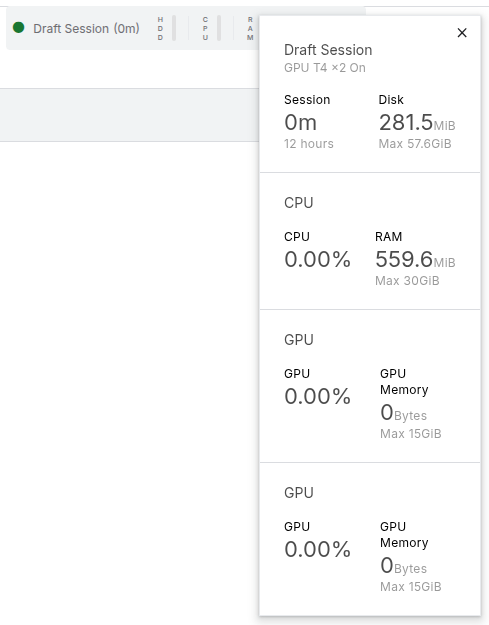
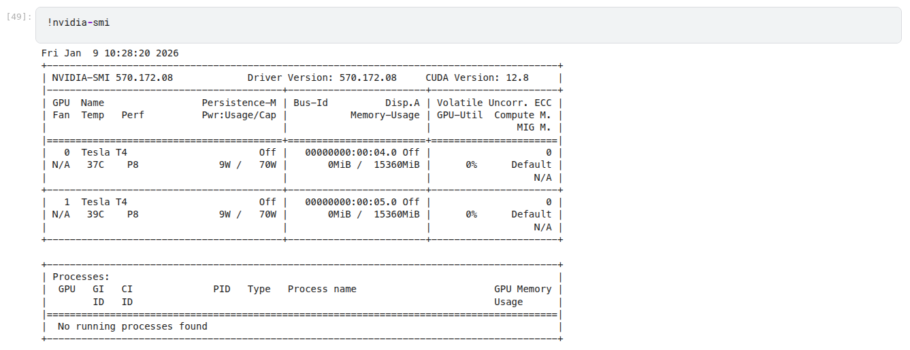
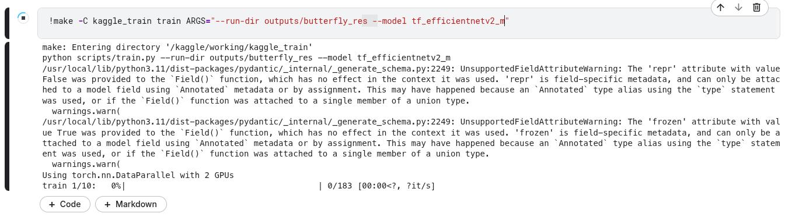

# Kaggle 训练指北

> 旨在通过Kaggle的免费GPU算力，进行模型训练


### 前提

1. 科学上网

> 基本操作，科研不二之选

2. 所需数据集网址，可通过[谷歌数据集搜索](https://datasetsearch.research.google.com/)

> 如果查询到了kaggle上已开源的最好，也可以通过下载链接的方式
>
> 大多数据集下载连接依靠[谷歌云盘](https://drive.google.com/drive/home)寄存数据集

3. google的账户

>  可以不用，但最好有，方便进行一键注册等

4. 准备好自己的github仓库

> 一些私有库（private repo）可能需要授权，需通过ssh密钥授权，可能对你的账户或库造成一些安全隐患，请自行评估风险


### 指北

> 准备好上述内容后就可以开始食用

#### Kaggle平台准备

- 注册kaggle账号

[Kaggle](https://www.kaggle.com/account/login)

可通过谷歌账户一键注册登陆，或者使用email注册

- 验证手机号

完成登陆后，找到[个人设置页面](https://www.kaggle.com/settings)  —> Phone verification

点击verify进行验证（支持+86中国号码，或者通过sms-activate等虚拟号平台（自行尝试，未经验证可行性））

验证过程可能需要手机扫码进行人脸验证，照做即可

- 创建[notebook](https://docs.jupyter.org.cn/en/latest/#google_vignette) 

> Notebook是一种可共享的文档，它结合了计算机代码、纯语言描述、数据、丰富的可视化效果（如 3D 模型、图表、图形和图片）以及交互式控件。笔记本与编辑器（如 JupyterLab）一起，为代码原型设计和解释、数据探索和可视化以及与他人分享想法提供了一个快速的交互式环境。

点击kaggle默认页面左上角的Create创建一个notebook



**重要**：
依次点击上方settings —> Turn On Internet
如不打开无法连接外网

再进入 settings—> Accelerator —> GPU T4 * 2，选择一个你喜欢的GPU/TPU

> 弹出提示 每周有 30 小时开机额度



Turn on以后点击右上角开机，稍作等待即可开始操作这台GPU云服务器






> 欣赏一下免费的30GB  GPU ， 30GB RAM，50GB+ 存储空间，即可**关机**，进行其他准备


#### 训练演示（2x T4 / 30GB RAM）

> 这里以本仓库为例

- 启动你的notebook

- 在 Kaggle Notebook 右侧 `Add data` 添加数据集 `phucthaiv02/butterfly-image-classification` 

    - 该数据集会挂载到 /kaggle/input/

    - 可以通过notebook的魔法指令来执行shell命令

        ```notebook
        %ls /kaggle/input/
        !ls /kaggle/input/
        ```
或者存在下载链接的，可以通过wget等指令下载,亦或者通过编写python脚本下载 (scripts/download_dataset.py)

> 自编python记得启用多线程下载

```bash
# wget下载
!wget DATASET_DOWNLOAD_URL -O /kaggle/input/YOUR_DATASET_NAME.zip
# 解压
!unzip /kaggle/input/YOUR_DATASET_NAME.zip -d /kaggle/input/YOUR_DATASET_NAME
```
> 编写的训练脚本要符合数据集结构哦


- 克隆代码仓库

    ```shell
    !git clone https://github.com/ACpeel/kaggle_train.git
    ```

    > 该指令会在`/kaggle/working/`目录下执行

    ```shell
    !pwd
    !ls /kaggle/working/kaggle_train
    ```

##### 开始训练


```bash
!nvidia-smi
```



一些自己的库，可能需要创建conda或uv环境并安装依赖
```bash
# 自行解决
!pip install -r YOUR_REPO/requirements.txt
```

```bash
# 将数据集移动到合适位置
!make -C kaggle_train dataset

# 或者使用
!python kaggle_train/scripts/get_dataset.py
```

使用efficientnetv2模型做分类训练

```bash
 !make -C kaggle_train train ARGS="--run-dir outputs/butterfly_res --model tf_efficientnetv2_m"
```


make 是linux支持的构建指令，通过Makefile来实现管理

如不想通过make，也可以直接使用如下命令

```bash
!python kaggle_train/scripts/train.py --run-dir outputs/butterfly_res --model tf_efficientnetv2_m
```




--- 


